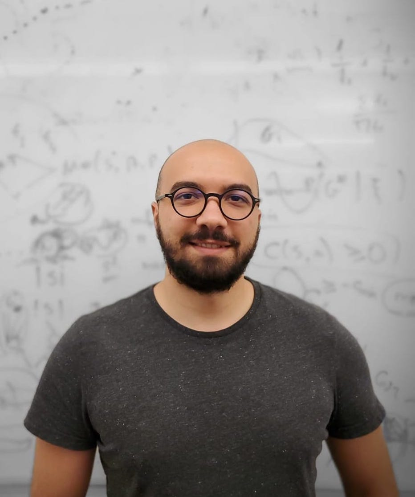

 

I am a PhD student in the Department of Aerospace Engineering at the University of Texas at Austin and a member of [Autonomous Systems Group](https://www.ae.utexas.edu/facultysites/topcu/wiki/index.php/Main_Page). I am broadly interested in developing autonomous systems that operate in complex, uncertain, and potentially adversarial domains with verifiable safety and performance guarantees. My recent work has focused on the theoretical and computational aspects of **manipulative decision-making**, which encapsulates capabilities that enable an autonomous system to achieve its objective by influencing the perceptions, decisions, and predictions of other systems. My research draws from controls, optimization, formal methods, and information theory, and provides solutions to problems arising in robotics, e-commerce, and mobility-on-demand applications.
